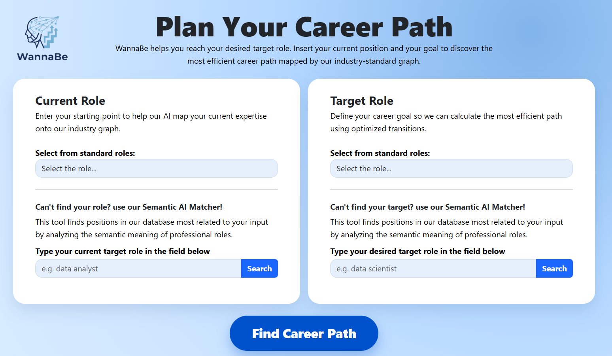
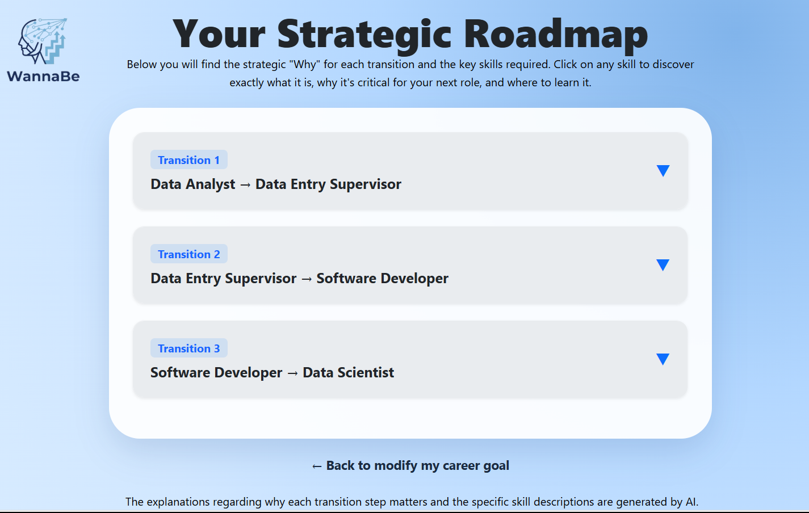
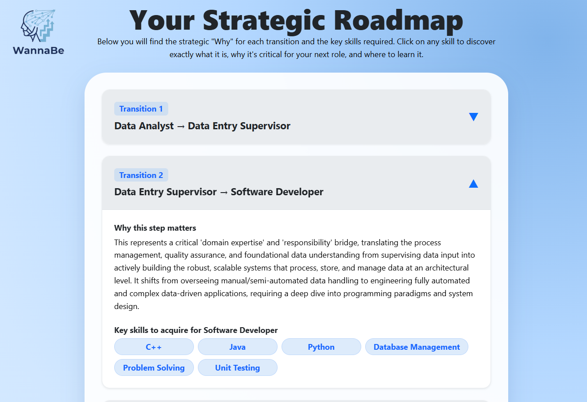
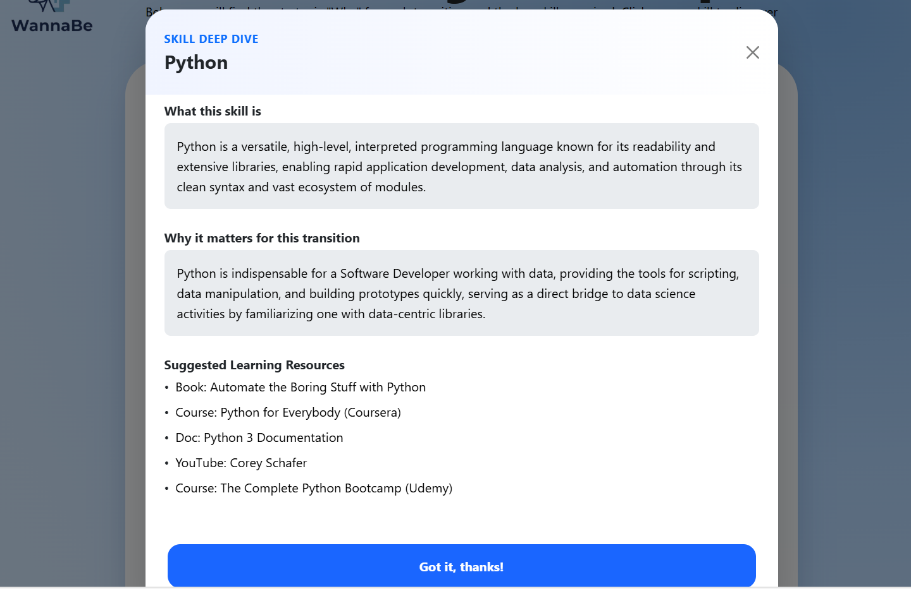

# WannaBe  
## Intelligent Career Transition Recommender

WannaBe is an intelligent decision-support system designed to transform noisy, unstructured career histories into actionable, data-driven professional roadmaps. By combining semantic role resolution, probabilistic graph modeling, large-scale skill extraction, and grounded LLM narration, WannaBe provides users with a clear and statistically validated path from their current role to their ultimate career goal.

---

## Overview

### The Problem

Traditional career platforms focus on job listings or static employment histories. They lack tools for planning multi-step career transitions. Users often know their destination role but struggle to identify the intermediate career "hops" and the specific technical DNA required to reach it.

### The Solution

WannaBe constructs a Directed Transition Graph from thousands of historical job sequences. It resolves informal job titles into canonical professional roles using high-performance semantic vector search and computes the most efficient transition path between them.

Each transition step is enriched with:
- Role-defining skills identified via Big Data processing.
- Transition probabilities based on historical career moves.
- Strategic explanations grounded in real-world professional data.

---

## Application Demo

### Role Selection and Semantic Matching



Users define their current role and target role either by selecting from standardized roles or by using the Semantic AI Matcher, which resolves free-text input into canonical professional roles using vector similarity.

---


When a role is not found directly, the system presents semantically similar roles ranked by cosine similarity, allowing users to select the most appropriate canonical role.

---

### Strategic Career Roadmap Generation



The system generates a multi-step career roadmap using a probabilistic directed graph, presenting the optimal sequence of intermediate transitions toward the target role.

---



Each transition can be expanded to reveal the strategic rationale behind the step, explaining why the move is necessary and how it functions as a seniority or skill bridge.

---

### Skill Deep Dive and Learning Guidance



For every transition, users can explore role-defining skills in depth. Each skill includes a definition, its importance for the transition, and curated learning resources to bridge the identified skill gap.

## System Architecture

### Semantic Role Resolution

To handle vocabulary mismatch in job titles, WannaBe uses Sentence-BERT (all-MiniLM-L6-v2) to encode job roles into 384-dimensional embeddings. A FAISS (Facebook AI Similarity Search) index enables near-instant mapping of free-text user input to our canonical professional roles.

---

### Graph-Based Pathfinding

Career transitions are represented as edges in a directed graph, weighted by empirical probabilities.

Algorithm:  
Dijkstra’s algorithm is used to compute the shortest path (highest probability).

Cost Function:

Weight = -ln(P) + γ


Where:
- P is the transition probability.
- γ (set to 1.0) is a regularization hyperparameter that balances statistical realism with path efficiency, preventing overly long or weak roadmaps.

---

## Automated Skill Extraction Pipeline (Big Data Processing)

The Skill Extractor is a PySpark-based pipeline responsible for identifying the "technical DNA" of every role. This ensures advice is grounded in market requirements rather than generic descriptions.

### Mechanism

- NLP Pre-processing:  
  Standardizes titles and descriptions using Spark NLP, removing noise and non-informative text.

- Pattern-Based Extraction:  
  Uses complex Regex and tokenization to identify technical competencies, tools, and methodologies.

- Statistical Frequency Filtering:  
  Implements the RCA principle by calculating skill frequency within job clusters. Only skills appearing above a specific threshold (e.g., the top 10 most frequent) are promoted to the final role_skills_list.csv.

---

## Hybrid Strategic Narration

WannaBe addresses the "Interpretability Gap" identified in prior research (Ghosh et al., 2020) by combining deterministic data retrieval with generative narration. Unlike "black-box" systems, the AI Coach does not hallucinate career advice; it acts as a narrative interface for the statistical data calculated by the system's core engines.

### Narrative Orchestration Algorithms

- Deterministic Path Retrieval:  
  The narrative layer first ingests the specific sequence of canonical roles generated by the Dijkstra Search and the corresponding Transition Probabilities $(-\ln(P) + \gamma)$.

- RCA-Grounded Metadata Enrichment:  
  For each transition "hop," the system queries the role_skills_list.csv to retrieve the top technical competencies. These skills are pre-validated via Revealed Comparative Advantage (RCA) logic, ensuring the explanation focuses on role-defining skills rather than generic requirements.

- Automated Skill-Gap Mapping:  
  For every step in the roadmap, the system performs a set-difference operation between the "Source Role Skills" and the "Target Role Skills." This algorithmically identifies the exact Skill Delta the user needs to bridge.

- Constrained LLM Grounding:  
  The identified path, skill-gaps, and transition weights are passed to the LLM (Gemini) through a strictly constrained prompt. By grounding the LLM in pre-computed CSV and Graph metadata, the system ensures that the "AI Coach" remains transparent, trustworthy, and entirely data-driven.

---

## Repository Structure

### Research and Development

- Graph_Creation_and_Searching.ipynb  
  Data cleaning, probability estimation, graph construction, and Dijkstra implementation.

- Semantic Similarity Search for Professional Roles.ipynb  
  Sentence-BERT benchmarking and FAISS index construction.

- skill_extractor.ipynb  
  Large-scale skill extraction pipeline implemented with PySpark and Spark NLP.

---

### Performance Artifacts (The Models)

- wannabe_graph.pkl  
  Serialized directed transition graph with statistical weights.

- wannabe_index.bin  
  High-speed FAISS binary index for semantic search.

- canonical_roles.pkl  
  Mapping of standardized job roles.

- role_skills_list.csv  
  Final output of the Spark pipeline mapping Roles → Skills.

---

### Application Implementation

- app.py  
  Flask orchestration layer handling API requests.

- graph_logic.py  
  Core logic for FAISS search and graph pathfinding.

- static/ & templates/  
  Frontend assets and interactive UI logic.

---

## Installation and Usage

### Prerequisites

- Python 3.10 or higher  
- Java 8+ (required for PySpark)  
- Google Gemini API key  

---

### Setup

Clone the repository:
```bash
git clone https://github.com/shalev121/WannaBe-Project.git
cd WannaBe-Project
```

Install dependencies:
```bash
pip install -r requirements.txt
```

Configure Environment: Create a .env file in the root directory:

GEMINI_API_KEY=your_api_key_here

Run the Application:
python app.py

Access the UI:
http://localhost:5000

## Academic & Theoretical Foundation

WannaBe is theoretically grounded in four seminal research papers that provide the mathematical and structural logic for our career transition algorithms.

---

### 1. Relational Mobility and Deep Learning Matchers

**Shalaby et al. (2018):**  
*Help Me Find a Job: A Graph-based Approach for Job Recommendation at Scale.*

**Project Application:**  
Provides the rationale for modeling professional mobility as a homogeneous directed graph of roles rather than a user-centric model.

**Specific Algorithm:**  
Justifies the use of Maximum Likelihood Estimation (MLE) to compute asymmetric transition probabilities and implements the Deep Learning Matcher (DLM) theory via Sentence-BERT to resolve semantic ambiguity and the "cold-start" problem in job titles.

---

### 2. Skill-Centric Standardization

**Gugnani et al. (2018):**  
*Generating Unified Candidate Skill Graph for Career Path Recommendation.*

**Project Application:**  
Establishes the theory that skills, not job titles, are the "unified building blocks" of career mobility.

**Specific Algorithm:**  
Informs our Skill Extraction Pipeline, which treats skills as first-class entities to solve the "Title Inflation" problem, where identical technical roles carry different names across different organizations.

---

### 3. Career Pathing as an Optimization Problem

**Ghosh et al. (2020):**  
*Skill-based Career Path Modeling and Recommendation.*

**Project Application:**  
Formulates career progression as a Computational Path Planning Problem toward a long-term goal rather than a single-hop recommendation.

**Specific Algorithm:**  
Grounded our choice of Dijkstra’s Algorithm and our cost function:

Weight = -ln(P) + γ

as a deterministic method to identify the most feasible sequence of intermediate milestones. It also highlights the need for actionable feedback, which we address via our Narrative LLM layer.

---

### 4. Asymmetric Transitions and Skill Importance (RCA)

**Dawson et al. (2021):**  
*Skill-driven Recommendations for Job Transition Pathways.*

**Project Application:**  
Establishes that professional transitions are directional and asymmetric, for example, the difficulty of moving from Junior to Senior is mathematically distinct from the reverse.

**Specific Algorithm:**  
Justifies our Statistical Frequency Filtering through the principle of Revealed Comparative Advantage (RCA), ensuring that our system isolates unique "role-defining" skills rather than ubiquitous, non-informative generalities..
